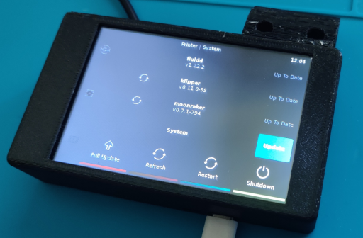

# RadxaZeroKlipperScreen

Compact Klipper based 3d-Printer control panel with 4 inch touch screen.

Radxa Zero: https://wiki.radxa.com/Zero

Lcd: http://www.lcdwiki.com/4.0inch_SPI_Module_ST7796

### Setup:

1. Armbian install
    1. A Install on MMC:
        Copy https://www.armbian.com/radxa-zero/ image into mmc card using eg https://gitlab.com/bztsrc/usbimager

    1. B Install on eMMC:
        1. Copy https://www.armbian.com/radxa-zero/ image and fallow https://wiki.radxa.com/Zero/install/eMMC instruction by:
            - Hold down the “USB BOOT” button on the Radxa Zero while connecting the USB cable
            - Run usb disk loader `sudo boot-g12.py rz-udisk-loader.bin`
            - Use eg https://gitlab.com/bztsrc/usbimager to load image into emulated Radxa Zero UDisk.
        2. Replace u-boot Armbian with Radxa u-boot (optional, may by done later):
            Armbian won't start from eMMC from time to time on my board with Armbian u-boot)
            - Fallow build procedure https://wiki.radxa.com/Zero/dev/u-boot or download u-boot image
                https://dl.radxa.com/zero/images/loader/u-boot.bin.sd.bin
            - Hold down the “USB BOOT” button on the Radxa Zero while connecting the USB cable
            - Run usb disk loader `sudo boot-g12.py rz-udisk-loader.bin`
            - Find /dev/sdX path to emulated Radxa Zero UDisk
                `sudo fdisk -l`
            - Copy u-boot into emulated Radxa Zero UDisk.
                `sudo dd if=u-boot.bin.sd.bin of=/dev/sdX bs=1 count=444`
                `sudo dd if=u-boot.bin.sd.bin of=/dev/sdX bs=512 skip=1 seek=1`

2. Setup Armbin
    - Connect serial terminal to Sys Uart
    - Power up and fallow Armbian setup

3. Install Lcd Driver
    1. Login and copy lcd_driver directory into board
    2. Build st7796 module
        - `cd lcd_driver/st7796`
        - `make && sudo make install`
        - verify module is working by
            `sudo modprobe st7796`
            `lsmod | grep st7796`
    3. Devicetree Overlay
        - `cd ../dtoverlay/`
        - `./install.sh`
        - reboot and verify lcd is working
    4. Install xorg
        - `sudo apt update && sudo apt install xserver-xorg-input-evdev`
        - `cd lcd_driver/xorg.conf.d/`
        - `sudo cp 99-calibration.conf /usr/share/X11/xorg.conf.d`
        - `sudo cp 99-fbturbo.conf /usr/share/X11/xorg.conf.d`
        - `sudo cp /usr/share/X11/xorg.conf.d/10-evdev.conf /usr/share/X11/xorg.conf.d/45-evdev.conf # fix for touch issue`

4. Use https://github.com/th33xitus/kiauh to install Klipper and KlipperScrean
    - check /dev/fbX device, see: https://klipperscreen.readthedocs.io/en/latest/Troubleshooting/#screen-shows-console-instead-of-klipperscreen
    - Aux Uart is /dev/ttyAML6

TODO:
    1. check spi errors: st7796 spi0.0: SPI transfer timed out
    2. improve cleanup kernel module
    3. use DKMS to moudule auto rebuild
    4. add freecad 3d models
